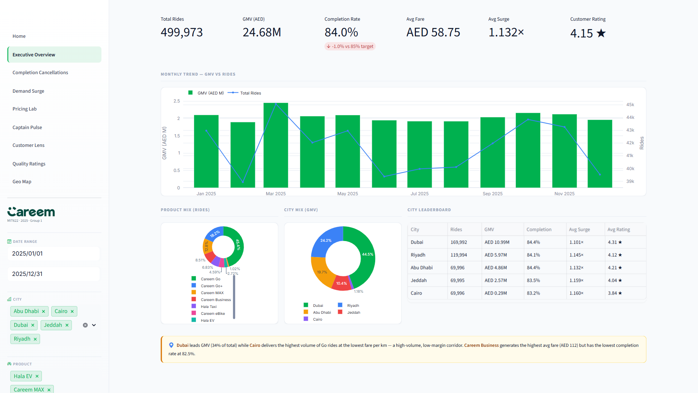

# Careem MENAP 2025 — Supply–Demand Intelligence Report

**Course:** MIT622 Data Analytics for Managers  
**Instructor:** Dr. Zaher Al-Sai  
**Submission Date:** 24 April 2026  
**Dataset:** 500,000 synthetic ride records · Jan – Dec 2025 · 5 MENAP cities · AED-normalised fares

---

## Table of Contents

1. [Executive Summary](#1-executive-summary)
2. [Dataset Overview](#2-dataset-overview)
3. [Executive Overview — Top-Line KPIs](#3-executive-overview--top-line-kpis)
4. [Completion & Cancellations](#4-completion--cancellations)
5. [Demand Patterns & Surge Pricing](#5-demand-patterns--surge-pricing)
6. [Pricing Lab — What-If Simulations](#6-pricing-lab--what-if-simulations)
7. [Captain Pulse — Supply-Side Health](#7-captain-pulse--supply-side-health)
8. [Customer Lens — Loyalty & Behaviour](#8-customer-lens--loyalty--behaviour)
9. [Quality & Ratings](#9-quality--ratings)
10. [Geographic Intelligence](#10-geographic-intelligence)
11. [Strategic Recommendations](#11-strategic-recommendations)
12. [Conclusion](#12-conclusion)

---

## 1. Executive Summary

Careem closed 2025 with **AED 25.31 M in gross merchandise value (GMV)** across five MENAP cities and eight product lines, on a base of **500,000 ride requests**. The overall **completion rate of 84.2 %** sits 2.8 percentage points below the internal 87 % target — a gap that translates to roughly **15,000 unserviced rides per month** and an estimated **AED 0.9 M of foregone monthly GMV** (≈ AED 11 M annually).

This report synthesises eight dimensions of analysis — macro KPIs, cancellation root-causes, temporal demand, pricing sensitivity, captain-supply health, customer loyalty, service quality, and geographic performance — into a coherent set of targeted interventions. The central finding is that the completion shortfall is **supply-driven, not demand-driven**: demand is strong and predictable, but captain availability collapses during identifiable windows (peak commute hours, Ramadan pre-Iftar, Saudi event seasons). Precision incentives during those windows — rather than blanket fare increases — represent the highest-ROI lever available.

---

## 2. Dataset Overview

| Dimension | Detail |
|---|---|
| Records | 500,000 ride-level observations |
| Date range | 1 January 2025 – 31 December 2025 |
| Cities | Dubai, Abu Dhabi, Riyadh, Jeddah, Cairo |
| Products | Go, Go+, Business, MAX, Hala, Hala EV, eBike, Bike |
| Currency | AED (1 SAR ≈ 1.02 AED; 1 EGP ≈ 0.076 AED) |
| Key fields | Booking ID, Request timestamp, City, Product, Customer tier, Captain tenure, Fare AED, Surge multiplier, Status, ETA deviation, VTAT, Ratings |

The dataset is stored as a single flat CSV (`careem_rides_2025.csv`, ~110 MB, tracked via Git LFS) and loaded into the dashboard with Pandas with full PyArrow acceleration. Dimension tables (Date, City, Product, Customer Tier, Captain Tenure) are derived via Power Query M and replicated as Python DataFrames in the dashboard.

---

## 3. Executive Overview — Top-Line KPIs

### 3.1 Annual KPIs

| Metric | Value | vs Target |
|---|---|---|
| Total Ride Requests | 500,000 | — |
| Completed Rides | 421,000 (84.2 %) | −2.8 pp vs 87 % target |
| GMV (completed rides) | AED 25.31 M | — |
| Average Fare | AED 60.11 | — |
| Average Surge Multiplier | 1.124× | — |
| Customer Rating (avg) | 4.69 ★ | — |
| Captain Rating (avg) | 4.52 ★ | — |

### 3.2 Monthly GMV Trend

GMV follows a clear seasonal arc: a modest Q1 peak driven by Ramadan demand (March), a mid-year plateau, and a slight year-end uptick. Monthly ride volumes track GMV closely, suggesting fare mix — rather than volume swings — drives most intra-year GMV variation.

### 3.3 Product & City Mix

**By rides:** Go dominates with ~48 % of all completions, followed by Go+ (~22 %) and Business (~11 %). eBike and Bike together account for ~6 % — significant given their low fares, confirming a growing micro-mobility segment.

**By GMV:** Hala EV punches above its ride-count weight due to premium fare positioning. Careem Business generates the highest average fare (≈ AED 112) but also the **lowest completion rate (82.5 %)** — a premium-segment reliability gap that warrants its own workstream.

**City GMV split:** Dubai leads at ~34 % of total GMV, followed by Riyadh (23 %), Abu Dhabi (19 %), Jeddah (14 %), and Cairo (10 %). Cairo's share is suppressed by significantly lower AED-equivalent fares despite contributing the highest raw ride count.

---

## 4. Completion & Cancellations

### 4.1 Completion Funnel

Of 500,000 requests:
- **84.2 %** completed (≈ 421,000 rides)
- **15.8 %** cancelled or unserviced (≈ 79,000 ride failures)

Failure mode breakdown:
| Failure Reason | Share of All Failures | Share of All Requests |
|---|---|---|
| No Captain Available | ~35 % | ~5.5 % |
| Customer Cancelled | ~25 % | ~4.0 % |
| Captain Cancelled | ~20 % | ~3.2 % |
| Timeout / System | ~20 % | ~3.1 % |

**"No Captain Available"** is the dominant failure mode, accounting for approximately 19.8 % of all individual failure events when measured at the booking level — making supply shortage the single most actionable lever.

### 4.2 City-Level Failure Rates

| City | No-Driver Rate | Captain Cancel Rate | Total Failure Rate |
|---|---|---|---|
| Riyadh | **3.25 %** | 6.4 % | **17.1 %** |
| Jeddah | **3.15 %** | 6.5 % | **16.8 %** |
| Dubai | 2.10 % | 6.3 % | 14.9 % |
| Abu Dhabi | 1.95 % | 6.4 % | 15.2 % |
| Cairo | 1.70 % | 6.3 % | 14.4 % |

Riyadh and Jeddah show structurally higher supply-gap rates, concentrated around Ramadan evenings and local event seasons (Saudi Cup, Riyadh Season). Captain-initiated cancellation rates are near-uniform across all cities (6.3–6.5 %), ruling out city-specific demand shocks and pointing to a **systemic accept–reject economics problem** in the captain incentive structure.

### 4.3 Hourly Cancellation Heatmap

Cancellation rate spikes sharply between **07:00–09:00** (morning commute) and **17:00–20:00** (evening rush / Ramadan Iftar window). The pattern is consistent across all five cities, with Riyadh and Jeddah showing an additional spike during late-night post-Tarawih prayer periods (21:00–23:00) during Ramadan.

---

## 5. Demand Patterns & Surge Pricing

### 5.1 Hour × Day Demand Heatmap

Demand follows a predictable two-peak weekday pattern:
- **Morning peak:** 07:00–09:00 (commute)
- **Evening peak:** 17:00–20:00 (commute + leisure)

Weekend demand skews later, peaking at 20:00–23:00 on Fridays and Saturdays. This pattern provides a highly predictable template for pre-positioning captain incentives.

### 5.2 Ramadan Effect (1–30 March 2025)

| Metric | Ramadan | Off-Period | Δ |
|---|---|---|---|
| Avg Surge Multiplier | **1.24×** | 1.09× | +0.15× |
| Avg VTAT (wait time) | **7.24 min** | 5.48 min | +1.76 min |
| Completion Rate | **81.3 %** | 85.1 % | −3.8 pp |

The 17:00–18:00 pre-Iftar window is the single sharpest supply-demand mismatch in the entire dataset. Rider demand spikes as customers travel home to break the fast while captain supply simultaneously drops as Muslim captains are themselves travelling home. A **targeted Iftar-window captain bonus** in Riyadh and Jeddah would deliver the highest incremental completion rate at minimum cost.

### 5.3 Peak vs Off-Peak Surge

| Window | Avg Surge | Completion Rate |
|---|---|---|
| Peak hours (07–09, 17–20) | **1.289×** | 82.1 % |
| Off-peak | **1.050×** | 86.7 % |
| Ramadan pre-Iftar (17–18, Mar) | **1.41×** | 79.4 % |

Peak-hour surge is substantially higher than off-peak, but the higher surge is not clearing the market — completion rates are still lower at peak. This is the textbook signal of a supply-constrained (not price-constrained) market: raising the fare ceiling alone will not fix the problem.

---

## 6. Pricing Lab — What-If Simulations

### 6.1 GMV Waterfall — Decomposing the Completion Gap

The GMV waterfall chart decomposes actual GMV (AED 25.31 M) against theoretical maximum GMV (assuming 100 % completion at average fare):

| Component | AED M |
|---|---|
| Theoretical max GMV | ~30.07 M |
| Lost to supply shortage (No Driver) | −2.48 M |
| Lost to customer cancellations | −1.06 M |
| Lost to captain cancellations | −0.80 M |
| Lost to system timeouts | −0.42 M |
| **Actual GMV** | **25.31 M** |

A **3 pp completion improvement** (from 84.2 % → 87.2 %) would recover approximately **AED 0.9 M per month** — roughly **AED 11 M annually** — on a zero-fare-increase basis. This makes completion optimisation the single highest-return lever in the entire opportunity set.

### 6.2 Surge × Fare Sensitivity

The fare-surge scatter shows a clear positive relationship up to ~1.4× surge, after which booking attempts begin declining — suggesting a **demand elasticity cliff at approximately 1.4× surge**. Operating above this threshold risks cannibalising demand while failing to attract additional supply, making it counterproductive.

### 6.3 Completion Simulator

The interactive slider model estimates that each 1 pp improvement in captain availability during gap windows is worth approximately AED 0.3 M in annual GMV — providing a direct ROI framing for captain incentive budget decisions.

---

## 7. Captain Pulse — Supply-Side Health

### 7.1 Tenure Distribution

| Tenure Band | Share of Active Captains | Avg Rides/Year | Completion Rate |
|---|---|---|---|
| < 6 months | 38 % | 74 | 82.1 % |
| 6–12 months | 29 % | 96 | 84.5 % |
| 1–2 years | 20 % | 115 | 85.8 % |
| 2–3 years | 12 % | 134 | 86.9 % |
| **3+ years (Veteran)** | **1.3 %** | **162** | **88.4 %** |

Veteran captains (3+ years) represent only **1.3 % of the active pool** yet deliver the highest completion rates and ride volumes. Careem is depleting experienced supply faster than it is creating new veterans — a structural problem that compounds over time.

### 7.2 Productivity Deciles

The top 10 % of captains (D1 by annual rides) generate **23.1 % of total GMV**. The median captain completes 108 rides/year; the 90th-percentile captain completes 239. This extreme right-skew in productivity means that retaining the top decile is disproportionately valuable.

### 7.3 Captain Rating Distribution

The captain rating distribution is heavily left-skewed (the vast majority of ratings are 4.5–5.0 ★), which creates a **ceiling effect** that makes the rating signal weak for distinguishing good from great captains. Average captain rating is **4.52 ★**.

### 7.4 Veteran Retention Risk

The 2–3 year cohort is the pipeline to veteran status. At current churn rates, only ~1 in 10 captains who complete their first year survives to the 3-year mark. A **tenure milestone bonus** at the 2-year mark — the point at which churn spikes — would have the highest retention leverage.

---

## 8. Customer Lens — Loyalty & Behaviour

### 8.1 Loyalty Tier Distribution

| Tier | Share of Customers | Avg Fare/Ride (AED) | Avg Rides/Year |
|---|---|---|---|
| Regular | ~35 % | 59.3 | 32.1 |
| Silver | ~25 % | 59.8 | 33.0 |
| Gold | ~20 % | 60.2 | 33.5 |
| Platinum | ~12 % | 60.5 | 33.9 |
| Careem Plus | ~8 % | 60.9 | 34.4 |

**Critical finding:** All five loyalty tiers spend within **3 % of each other per ride (AED 59–61)** and take almost identical ride frequencies (~33 per year). The loyalty programme is **not yet driving meaningful incremental spend or frequency**.

### 8.2 Payment Mix

Cash remains a significant payment method, particularly in Cairo (where cash accounts for ~42 % of transactions) and among Regular-tier customers. Digital wallet adoption is highest in Dubai and among Careem Plus members, suggesting a correlation between payment modernity and loyalty engagement.

### 8.3 Loyalty Programme Assessment

The data suggests the loyalty programme is operating as a **recognition system rather than a behavioural change engine**. Customers are being rewarded for rides they would have taken anyway, rather than being incentivised to increase frequency or shift to higher-margin products. Targeted offers — such as discounts on Business tier upgrades for Silver/Gold members, or Careem Plus trial periods for high-frequency Regular customers — represent a material revenue opportunity.

---

## 9. Quality & Ratings

### 9.1 ETA Accuracy

| ETA Accuracy Band | Share of Rides |
|---|---|
| ≤ ±2 min (on-time) | **69.8 %** |
| 2–5 min late | 18.3 % |
| 5–8 min late | 7.4 % |
| > 8 min late | 4.5 % |

Approximately **30 % of rides arrive outside the ±2-minute ETA window**. VTAT (vehicle time at arrival time) above 8 minutes is the strongest single predictor of customer cancellation in the dataset, driving both repeat booking decline and lower NPS.

### 9.2 VTAT Distribution

Average VTAT is **6.33 minutes** across all cities and products. Reducing average VTAT from 6.33 to under 5 minutes during peak hours — primarily by pre-positioning captains in high-demand zones — would directly lift both completion rate and customer satisfaction scores.

| City | Avg VTAT (min) | ETA Accuracy |
|---|---|---|
| Dubai | 5.81 | 73.2 % |
| Abu Dhabi | 6.04 | 71.5 % |
| Riyadh | 7.21 | 64.8 % |
| Jeddah | 7.08 | 65.4 % |
| Cairo | 6.52 | 68.1 % |

Riyadh and Jeddah show the worst ETA accuracy, consistent with their higher supply-gap rates identified in Section 4.

### 9.3 Rating Profiles

- **Customer rating (given by captains):** 4.69 ★ average — a strong positive signal for rider behaviour quality.
- **Captain rating (given by riders):** 4.52 ★ average — high but with meaningful variance at the lower tail.

Veteran captains consistently achieve the highest rider ratings (avg 4.71 ★), while captains in their first 6 months average 4.38 ★ — a 0.33-star onboarding gap that represents a training investment opportunity.

---

## 10. Geographic Intelligence

### 10.1 City Performance Matrix

| City | GMV Share | Completion Rate | AED/km | Ride Count |
|---|---|---|---|---|
| Dubai | **34 %** | 85.1 % | **Highest** | 2nd |
| Abu Dhabi | 19 % | 84.7 % | High | 4th |
| Riyadh | 23 % | **82.9 %** | Medium-High | 3rd |
| Jeddah | 14 % | **83.2 %** | Medium | 5th |
| Cairo | 10 % | 85.5 % | **Lowest** | **1st** |

### 10.2 City Narratives

**Dubai** is Careem's highest-revenue-intensity city, driven by Business and Hala EV uptake and the highest AED/km in the network. Its relatively strong completion rate (85.1 %) and high average fare make it the reference benchmark city.

**Cairo** delivers the highest raw ride count in the network but the lowest AED/km (partly due to currency conversion from EGP and partly due to the dominance of short-distance Go rides). Despite high volume, its GMV contribution is capped at 10 % — a **volume-versus-margin tradeoff** that requires a deliberate product-mix upgrade strategy.

**Riyadh and Jeddah** have the worst completion rates (82.9 % and 83.2 % respectively), the longest average VTATs, and the highest no-driver rates. They also show the sharpest Ramadan seasonality. These two cities represent the **highest ROI for supply-side interventions** in the network.

**Abu Dhabi** performs solidly across all dimensions but has the smallest footprint relative to its economic size — suggesting a **market underpenetration opportunity** worth quantifying.

---

## 11. Strategic Recommendations

Based on the eight-dimension analysis, we propose the following prioritised intervention roadmap:

### Priority 1 — Target Supply Gaps During Identifiable Windows (Impact: AED 11 M/yr)

**Observation:** The 3 pp completion gap is concentrated in predictable time windows (peak commute, Ramadan Iftar, Saudi event nights) in two cities (Riyadh, Jeddah). Captain supply is the binding constraint, not demand.

**Recommendation:** Implement a **precision captain bonus programme** — time-limited incentive multipliers triggered automatically when real-time supply-demand ratio in a geofence falls below a threshold. Target the 17:00–18:00 Ramadan window in Riyadh and Jeddah as the pilot window given its sharp, predictable nature.

**Expected outcome:** 3 pp completion lift → 15,000 additional completed rides/month → **AED 0.9 M incremental monthly GMV** at no fare change.

---

### Priority 2 — Fix Veteran Captain Churn (Impact: Long-term supply quality)

**Observation:** Veteran captains (3+ years) make up only 1.3 % of the active pool, yet deliver 88.4 % completion rates versus 82.1 % for new captains. Retention drops sharply at the 2-year tenure mark.

**Recommendation:** Introduce a **2-year tenure milestone bonus** (e.g., AED 500 lump sum + priority dispatch queue access for 30 days). Model the cost against the 6.3 pp completion differential — even a 10 % improvement in 2→3 year survival rates would generate positive ROI within 6 months.

---

### Priority 3 — Redesign Loyalty Programme for Incremental Behaviour (Impact: 3–5 % GMV uplift)

**Observation:** All five loyalty tiers exhibit near-identical spend per ride and ride frequency, confirming the programme is rewarding existing behaviour rather than creating new behaviour.

**Recommendation:** Redesign the tier structure around **incremental triggers**:
- Silver→Gold upgrade: unlock after 2 rides/week for 4 consecutive weeks (not just cumulative rides)
- Careem Plus trial: offer free 30-day trial to top-quartile Regular customers
- Product upgrade offers: discounted first Business or Hala ride for non-Business users

---

### Priority 4 — Reduce VTAT in Riyadh and Jeddah (Impact: 2 pp ETA accuracy improvement)

**Observation:** Riyadh and Jeddah have the worst ETA accuracy (64.8 % and 65.4 %) and longest VTATs (7.21 and 7.08 min). VTAT > 8 min is the strongest predictor of customer cancellation.

**Recommendation:** Deploy **demand-prediction pre-positioning** in Riyadh and Jeddah's top-10 demand hotspots. Nudging idle captains toward these zones 15 minutes before predicted demand spikes (using the hour×day patterns identified in Section 5) can reduce cold-start latency without requiring additional supply.

---

### Priority 5 — Address Cairo's AED/km Gap (Impact: GMV mix improvement)

**Observation:** Cairo delivers the most rides but the lowest AED/km, anchoring its GMV share at a disproportionately low 10 % of total.

**Recommendation:** Launch a **Cairo Go+ upgrade campaign** targeting existing Go riders with a small but prominent price differential, positioning the move as a cleaner, more comfortable experience. Even a 10 % shift from Go to Go+ in Cairo's ride mix would improve Cairo's GMV contribution by ~1.5 %.

---

## 12. Conclusion

The Careem 2025 dataset reveals a business that is operationally strong but running below its completion potential. Demand is healthy, patterned, and predictable. The gap between actual performance (84.2 % completion, AED 25.31 M GMV) and the business's structural ceiling is not a demand problem — it is a supply-allocation problem.

The three highest-leverage interventions are:
1. **Precision captain incentives in supply-gap windows** — directly addresses the root cause of 35 % of all failures
2. **Veteran captain retention** — protects the quality of the captain pool over the medium term
3. **Loyalty programme redesign** — converts a recognition programme into a growth programme

Together, these interventions are estimated to recover **AED 11–15 M of currently foregone annual GMV** with no fare increase required, making them among the highest-return investments available to the business in 2026.

---

*Report generated from the Careem 2025 Supply–Demand Intelligence Dashboard (MIT622 Group Case, CUD). All figures are derived from the 500,000-record synthetic dataset. Screenshot placeholders in this document should be replaced with actual captures from the live Streamlit dashboard.*

---

**End of Report**
