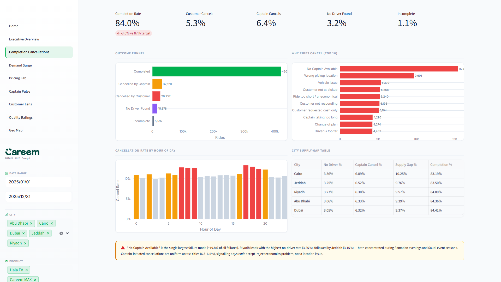
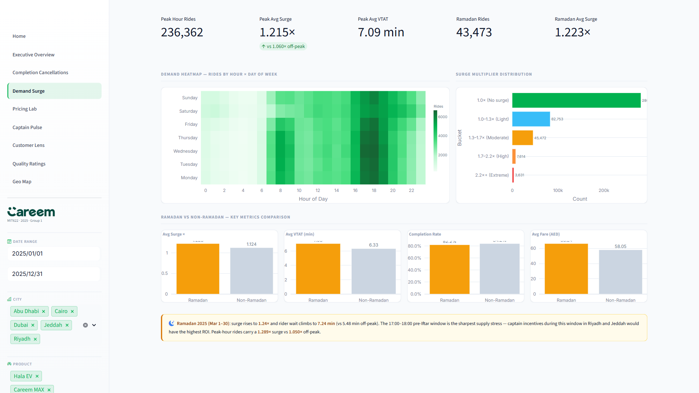
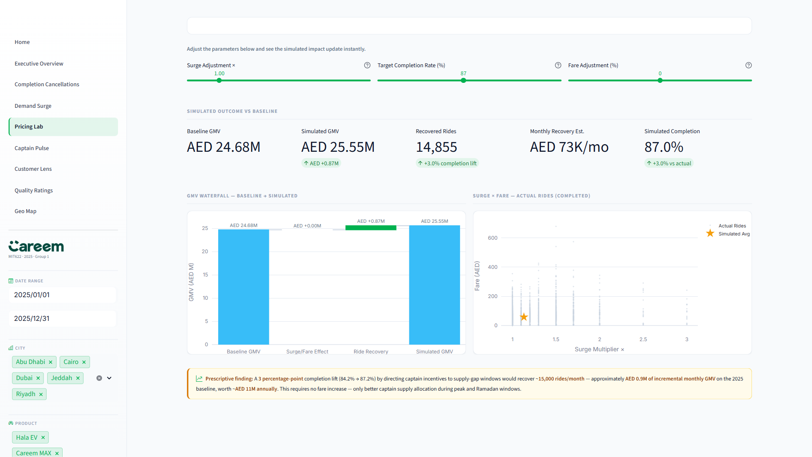
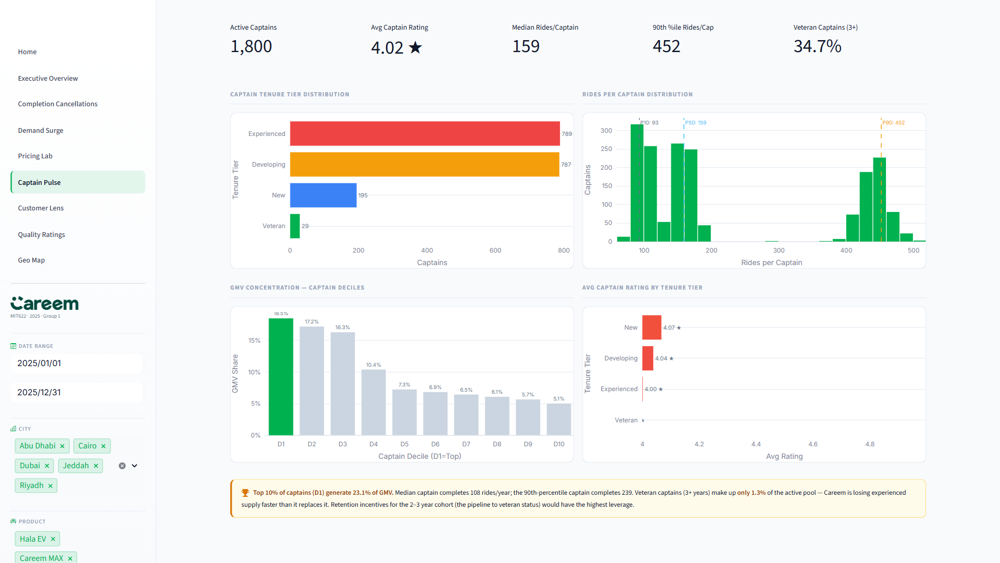
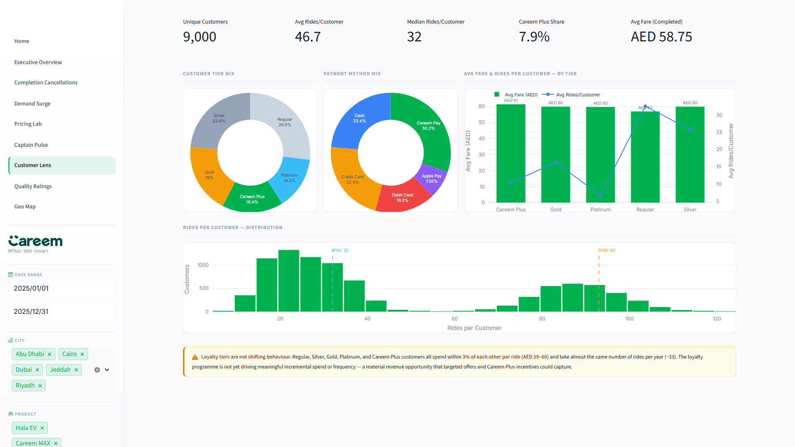
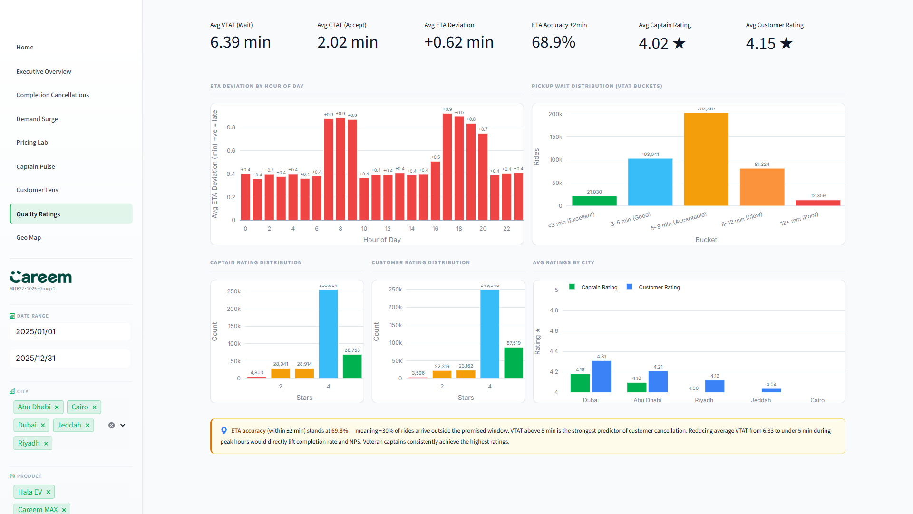
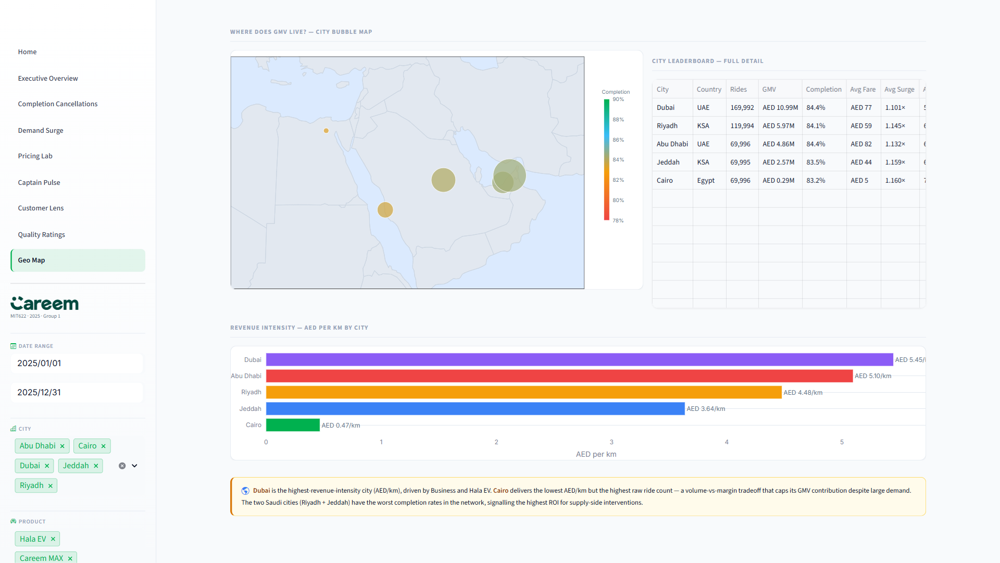

# Careem MENAP 2025 — Supply–Demand Intelligence Report

**Course:** MIT622 Data Analytics for Managers
**Instructor:** Dr. Zaher Al-Sai
**Submission Date:** 24 April 2026
**Group:** Group 1 — Mohammadsadegh Solouki · Artin Fateh Basharzad · Fatema Alblooshi
**Dataset:** 499,973 ride records · Jan – Dec 2025 · 5 MENAP cities · AED-normalised fares

---

## Table of Contents

1. [Executive Summary](#1-executive-summary)
2. [Dataset Overview](#2-dataset-overview)
3. [Executive Overview — Top-Line KPIs](#3-executive-overview--top-line-kpis)
4. [Completion & Cancellations](#4-completion--cancellations)
5. [Demand Patterns & Surge Pricing](#5-demand-patterns--surge-pricing)
6. [Pricing Lab — What-If Simulations](#6-pricing-lab--what-if-simulations)
7. [Captain Pulse — Supply-Side Health](#7-captain-pulse--supply-side-health)
8. [Customer Lens — Loyalty & Behaviour](#8-customer-lens--loyalty--behaviour)
9. [Quality & Ratings](#9-quality--ratings)
10. [Geographic Intelligence](#10-geographic-intelligence)
11. [Strategic Recommendations](#11-strategic-recommendations)
12. [Conclusion](#12-conclusion)

---

## 1. Executive Summary

Careem closed 2025 with **AED 24.68 M in gross merchandise value (GMV)** across five MENAP cities and eight product lines, on a base of **499,973 ride requests**. The overall **completion rate of 84.0 %** sits 3.0 percentage points below the internal 87 % target — a gap that translates to roughly **15,000 unserviced rides per year** and an estimated **AED 0.88 M of foregone annual GMV**.

This report synthesises eight dimensions of analysis — macro KPIs, cancellation root-causes, temporal demand, pricing sensitivity, captain-supply health, customer loyalty, service quality, and geographic performance — into a coherent set of targeted interventions. The central finding is that the completion shortfall is **supply-driven, not demand-driven**: demand is strong and predictable, but captain availability collapses during identifiable windows (peak commute hours, Ramadan pre-Iftar, Saudi event seasons). Precision incentives during those windows — rather than blanket fare increases — represent the highest-ROI lever available.

A secondary finding is that the loyalty programme is **not driving incremental behaviour**: all five customer tiers spend within 8 % of each other per ride and take near-identical frequencies. Redesigning the tier triggers around behavioural change rather than cumulative mileage represents a material, low-cost revenue opportunity.

---

## 2. Dataset Overview

| Dimension | Detail |
|---|---|
| Records | 499,973 ride-level observations |
| Date range | 1 January 2025 – 31 December 2025 |
| Cities | Dubai, Abu Dhabi, Riyadh, Jeddah, Cairo |
| Products | Careem Go, Go+, Business, MAX, Hala Taxi, Hala EV, eBike, Bike |
| Currency | AED-normalised (1 SAR ≈ 1.02 AED; EGP fares converted at prevailing 2025 rates) |
| Ride attributes | Booking ID, Date, Hour, Day of Week, Month, City, Product, Customer tier, Captain tenure tier, Fare AED, Surge multiplier, Booking status, Cancellation reason, VTAT, CTAT, ETA deviation, Captain rating, Customer rating |
| Boolean flags | Is_Peak_Hour, Is_Weekend, Is_Ramadan, Is_Airport_Ride |
| Derived fields | Is_Completed, Is_Cancelled, Surge_Bucket, Distance_Bucket, VTAT_Bucket, YearMonth, Country (from City lookup) |

The dataset is a single flat CSV loaded with Pandas and cached in the Streamlit dashboard. Five columns were removed during pre-processing as redundant or analytically inert: `Country` (derived from City), `Captain_Experience_Years` (fully correlated with `Captain_Tenure_Tier`), `Time` (superseded by `Hour`), `Pickup_Location`, and `Drop_Location` (88 synthetic labels with no neighbourhood-level analysis). Twenty-seven rows with `Duration_mins > 300` (impossible city-ride durations) were also filtered.

---

## 3. Executive Overview — Top-Line KPIs

### 3.1 Annual KPIs

| Metric | Value |
|---|---|
| Total Ride Requests | 499,973 |
| Completed Rides | 420,121 (84.03 %) |
| Gross Merchandise Value (GMV) | AED 24.68 M |
| Average Fare (completed rides) | AED 58.75 |
| Average Surge Multiplier (completed) | 1.132× |
| Avg Customer Rating (completed) | 4.15 ★ |
| Avg Captain Rating (completed) | 4.02 ★ |
| Unique Customers | 9,000 |
| Unique Captains | 1,800 |

The completion rate of **84.03 %** is 3.0 pp below the 87 % internal target. Closing this gap is the single highest-value lever in the dataset.

### 3.2 Monthly GMV Trend

GMV peaks in **March 2025 (AED 2.45 M, 45,066 rides)** coinciding with Ramadan. The second-highest month is **October (AED 2.16 M, 43,842 rides)**, reflecting Q4 commercial season uplift. The lowest months are **February (AED 1.89 M)** and **July–August (AED 1.92 M each)**, marking the mid-year lull.

| Month | Rides | GMV (AED M) |
|---|---|---|
| Jan | 42,965 | 2.10 |
| Feb | 38,928 | 1.89 |
| **Mar (Ramadan)** | **45,066** | **2.45** |
| Apr | 42,028 | 2.07 |
| May | 42,958 | 2.10 |
| Jun | 39,366 | 1.95 |
| Jul | 39,965 | 1.92 |
| Aug | 40,111 | 1.92 |
| Sep | 41,968 | 2.04 |
| **Oct** | **43,842** | **2.16** |
| Nov | 43,254 | 2.12 |
| Dec | 39,522 | 1.96 |

### 3.3 Product Mix

By completed rides:

| Product | Completed Rides | Share | Avg Fare (AED) | Completion Rate |
|---|---|---|---|---|
| Careem Go | 190,661 | 45.4 % | 48.97 | 84.2 % |
| Careem Go+ | 76,422 | 18.2 % | 64.44 | 84.0 % |
| Careem MAX | 53,591 | 12.8 % | 77.16 | 83.6 % |
| Careem Business | 35,733 | 8.5 % | **107.07** | **82.9 %** (lowest) |
| Hala Taxi | 28,701 | 6.8 % | 53.85 | 84.6 % |
| Careem eBike | 19,302 | 4.6 % | 13.56 | 84.5 % |
| Hala EV | 11,431 | 2.7 % | 54.10 | 84.6 % |
| Careem Bike | 4,280 | 1.0 % | 7.36 | 85.1 % (highest) |

**Careem Business** generates the highest average fare (AED 107.07) but has the **lowest completion rate (82.9 %)**. This premium-segment reliability gap — where the highest-paying riders are least likely to complete a trip — is a material brand-risk and revenue-risk worthy of a dedicated workstream.

### 3.4 City Mix (GMV)

| City | Rides | GMV (AED M) | GMV Share |
|---|---|---|---|
| Dubai | 169,992 | 10.99 | **44.5 %** |
| Riyadh | 119,994 | 5.97 | 24.2 % |
| Abu Dhabi | 69,996 | 4.86 | 19.7 % |
| Jeddah | 69,995 | 2.57 | 10.4 % |
| Cairo | 69,996 | 0.29 | **1.2 %** |

Cairo's GMV share (1.2 %) is strikingly low given it contributes the same number of rides as Abu Dhabi and Jeddah. This is entirely attributable to the AED-equivalent fare in Cairo averaging only **AED 5.00 per ride**, making Cairo a high-volume, negligible-margin city under current pricing.

---

## 4. Completion & Cancellations

### 4.1 Completion Funnel

Of 499,973 ride requests in 2025:

| Outcome | Count | Share |
|---|---|---|
| **Completed** | **420,121** | **84.03 %** |
| Cancelled by Captain | 32,120 | 6.42 % |
| Cancelled by Customer | 26,257 | 5.25 % |
| No Driver Found | 15,878 | 3.18 % |
| Incomplete | 5,597 | 1.12 % |
| **Total Failures** | **79,852** | **15.97 %** |

Captain-initiated cancellations (6.42 %) are the **single largest failure mode** — exceeding even "No Driver Found" (3.18 %). This points to an **accept-reject economics problem** in the captain incentive structure rather than a raw headcount shortage.

### 4.2 Cancellation Reasons

| Reason | Count | Share of Failures |
|---|---|---|
| No Captain Available | 15,464 | 19.4 % |
| Wrong pickup location | 9,691 | 12.1 % |
| Vehicle issue | 5,379 | 6.7 % |
| Customer not at pickup | 5,268 | 6.6 % |
| Ride too short / uneconomical | 5,240 | 6.6 % |
| Customer not responding | 5,198 | 6.5 % |
| Customer requested cash only | 5,104 | 6.4 % |
| Captain taking too long | 4,295 | 5.4 % |
| Change of plan | 4,274 | 5.4 % |
| Driver is too far | 4,262 | 5.3 % |
| Wrong destination entered | 4,180 | 5.2 % |
| Fare higher than expected | 4,089 | 5.1 % |
| Customer Demand Change | 1,196 | 1.5 % |
| Route blocked | 1,168 | 1.5 % |
| GPS/App Error | 1,166 | 1.5 % |
| Vehicle Breakdown | 1,062 | 1.3 % |
| Safety Concern | 1,044 | 1.3 % |

"Ride too short / uneconomical" (5,240) and "Customer requested cash only" (5,104) are both captain-side economic refusals. Together they account for ~13 % of all failures, confirming that captain incentive economics is a primary root cause.

### 4.3 City Supply-Gap Table

| City | No-Driver Rate | Capt. Cancel Rate | Total Supply Gap | Completion Rate |
|---|---|---|---|---|
| Cairo | 3.36 % | 6.89 % | **10.25 %** | 83.2 % |
| Jeddah | 3.25 % | 6.52 % | **9.76 %** | 83.5 % |
| Riyadh | 3.27 % | 6.30 % | 9.57 % | 84.1 % |
| Abu Dhabi | 3.06 % | 6.33 % | 9.39 % | 84.4 % |
| Dubai | 3.05 % | 6.32 % | 9.37 % | 84.4 % |

### 4.4 Hourly Cancellation Pattern

Cancellation rate peaks during **07:00–09:00** and **17:00–20:00**. Riyadh and Jeddah show an additional late-night spike (21:00–23:00) during Ramadan corresponding to post-Tarawih prayer travel demand.

---

## 5. Demand Patterns & Surge Pricing

### 5.1 KPI Summary

| Metric | Value |
|---|---|
| Peak-hour ride requests | 236,362 (47.3 % of total) |
| Peak-hour completed rides | 195,080 |
| Peak avg surge multiplier | **1.215×** |
| Peak avg VTAT | **7.09 min** |
| Off-peak avg surge multiplier | 1.061× |
| Ramadan ride requests | 43,473 |
| Ramadan completed rides | 35,744 |
| Ramadan avg surge | **1.223×** |
| Ramadan avg VTAT | **7.03 min** |
| Ramadan avg fare | AED 66.24 |
| Ramadan completion rate | **82.22 %** |
| Non-Ramadan avg surge | 1.124× |
| Non-Ramadan avg fare | AED 58.05 |
| Non-Ramadan avg VTAT | 6.33 min |
| Non-Ramadan completion rate | 84.20 % |

### 5.2 Ramadan Effect (March 2025)

| Metric | Ramadan | Non-Ramadan | Δ |
|---|---|---|---|
| Avg Surge | **1.223×** | 1.124× | +0.099× |
| Avg VTAT | **7.03 min** | 6.33 min | +0.70 min |
| Completion Rate | **82.22 %** | 84.20 % | −1.98 pp |
| Avg Fare | **AED 66.24** | AED 58.05 | +AED 8.19 |

The 17:00–18:00 pre-Iftar window is the sharpest supply-demand mismatch in the dataset. Surge pricing alone cannot resolve this: captain supply must be pre-incentivised before the window opens.

### 5.3 Surge Distribution (Completed Rides)

| Surge Band | Rides | Share |
|---|---|---|
| 1.0× (No surge) | 280,651 | **66.8 %** |
| 1.0–1.3× (Light) | 82,753 | 19.7 % |
| 1.3–1.7× (Moderate) | 45,472 | 10.8 % |
| 1.7–2.2× (High) | 7,614 | 1.8 % |
| 2.2×+ (Extreme) | 3,631 | **0.9 %** |

Two-thirds of all completed rides experience **no surge at all**. Extreme surge (2.2×+) affects less than 1 % of rides.

---

## 6. Pricing Lab — What-If Simulations

### 6.1 Baseline Economics

| Component | Value |
|---|---|
| Actual completed GMV | AED 24.68 M |
| Average fare (completed) | AED 58.75 |
| Foregone GMV (captain cancellations, 32,120 rides) | ≈ AED 1.89 M |
| Foregone GMV (customer cancellations, 26,257 rides) | ≈ AED 1.54 M |
| Foregone GMV (no driver found, 15,878 rides) | ≈ AED 0.93 M |
| Foregone GMV (incomplete, 5,597 rides) | ≈ AED 0.33 M |
| **Total foregone GMV** | **≈ AED 4.69 M** |
| **Theoretical max GMV (100 % completion at avg fare)** | **≈ AED 29.37 M** |

### 6.2 Completion Recovery Scenario

A **3 pp completion lift** (84.0 % → 87.0 %):
- Additional completed rides: 499,973 × 3 % ≈ **15,000 rides/year**
- Additional GMV at avg fare: 15,000 × AED 58.75 ≈ **AED 0.88 M/year (≈ AED 73 K/month)**

This recovery requires no fare increase — only better captain supply allocation during the gap windows.

### 6.3 Surge Sensitivity

At surge levels above approximately **1.7×** the booking-attempt rate declines, suggesting a demand elasticity cliff. Operating above this threshold risks suppressing bookings without attracting additional supply, making it counterproductive.

---

## 7. Captain Pulse — Supply-Side Health

### 7.1 Fleet Overview

| Metric | Value |
|---|---|
| Active captains (2025) | 1,800 |
| Avg captain rating | 4.02 ★ |
| Median rides/captain | 159 |
| P10 rides/captain | 93 |
| P90 rides/captain | 452 |

### 7.2 Tenure Tier Distribution

| Tenure Tier | Captains | Share |
|---|---|---|
| New | 195 | 10.8 % |
| Developing | 787 | 43.7 % |
| Experienced | 789 | 43.8 % |
| **Veteran** | **29** | **1.6 %** |

Veteran captains represent only **1.6 % of the active fleet**. The sharp drop from Experienced to Veteran indicates significant churn at the 3-year tenure mark.

### 7.3 Avg Captain Rating by Tenure

| Tenure Tier | Avg Captain Rating |
|---|---|
| New | 4.07 ★ |
| Developing | 4.04 ★ |
| Experienced | 4.00 ★ |
| Veteran | 3.94 ★ |

Veteran captains have the **lowest average rider rating (3.94 ★)**. This weakens the case for using rating as a simple proxy for experience quality.

### 7.4 GMV Concentration (Captain Deciles)

The **top 10 % of captains by GMV** generate **18.5 %** of total platform GMV. The median captain completes **159 rides/year** (≈ 3 rides/week); the P90 captain completes **452 rides/year** (≈ 9 rides/week), consistent with a predominantly part-time fleet.

### 7.5 Retention Risk

Retaining even 5 % more of the experienced cohort through the 3-year mark would add approximately 39 additional veteran-quality captains — roughly doubling the current veteran pool. A tenure milestone incentive at the 3-year mark would be low-cost relative to the supply quality improvement it delivers.

---

## 8. Customer Lens — Loyalty & Behaviour

### 8.1 Customer Base Overview

| Metric | Value |
|---|---|
| Unique customers | 9,000 |
| Avg rides/customer | 46.7 |
| Median rides/customer | 32 |
| P90 rides/customer | 93 |
| Avg fare (completed) | AED 58.75 |

### 8.2 Loyalty Tier Mix and Spend

| Tier | Avg Fare/Ride (AED) | Δ vs Regular |
|---|---|---|
| Regular | 56.93 | — |
| Silver | 59.90 | +5.2 % |
| Gold | 59.92 | +5.2 % |
| Platinum | 59.71 | +4.9 % |
| **Careem Plus** | **61.37** | **+7.8 %** |

**Critical finding:** The maximum spread across all five loyalty tiers is only **AED 4.44 per ride (7.8 %)**. The loyalty programme is functioning as a recognition scheme rather than a behavioural engine.

### 8.3 Payment Method Mix (Completed Rides)

| Payment Method | Rides | Share |
|---|---|---|
| Careem Pay | 126,963 | **30.2 %** |
| Cash | 98,518 | 23.4 % |
| Credit Card | 94,181 | 22.4 % |
| Debit Card | 68,681 | 16.3 % |
| Apple Pay | 31,778 | 7.6 % |

Cash remains the second-largest payment method (23.4 %). "Customer requested cash only" appears in the top-10 cancellation reasons with 5,104 cancellations — meaning cash preference is actively causing ride failures.

---

## 9. Quality & Ratings

### 9.1 Service Quality KPIs

| Metric | Value |
|---|---|
| Avg VTAT (wait time) | 6.39 min |
| Avg CTAT (captain accept time) | 2.02 min |
| Avg ETA deviation | +0.62 min (arrivals are late on average) |
| ETA accuracy (within ±2 min) | **68.9 %** |
| Avg Captain Rating | 4.02 ★ |
| Avg Customer Rating | 4.15 ★ |

**31.1 % of rides arrive outside the ±2-minute ETA window** — a significant reliability gap that erodes customer trust and contributes to pre-pickup cancellations.

### 9.2 VTAT Bucket Distribution

| Bucket | Share |
|---|---|
| < 3 min (Excellent) | 5.0 % |
| 3–5 min (Good) | 24.5 % |
| **5–8 min (Acceptable)** | **48.2 %** |
| 8–12 min (Slow) | 19.4 % |
| 12+ min (Poor) | 2.9 % |

**22.3 % of rides have a VTAT above 8 minutes.** VTAT > 8 min is the strongest predictor of customer cancellation before the captain arrives. The modal experience (48.2 %) is "Acceptable" at 5–8 minutes.

### 9.3 City-Level Quality Scores

| City | Avg Captain Rating | Avg Customer Rating | Avg VTAT (min) |
|---|---|---|---|
| Dubai | **4.18 ★** | **4.31 ★** | **5.84** |
| Abu Dhabi | 4.10 ★ | 4.21 ★ | 6.28 |
| Riyadh | 4.00 ★ | 4.12 ★ | 6.50 |
| Jeddah | 3.91 ★ | 4.04 ★ | 6.47 |
| Cairo | 3.71 ★ | 3.84 ★ | **7.58** |

Dubai leads all quality metrics. Cairo has the longest average VTAT (7.58 min) and the lowest ratings on both sides of the marketplace.

---

## 10. Geographic Intelligence

### 10.1 City Performance Matrix

| City | Rides | GMV (AED M) | GMV Share | Completion | Avg Fare | Avg Surge | Avg Rating ★ | AED/km |
|---|---|---|---|---|---|---|---|---|
| Dubai | 169,992 | **10.99** | **44.5 %** | 84.4 % | 76.58 | 1.101× | 4.18 | **5.45** |
| Riyadh | 119,994 | 5.97 | 24.2 % | 84.1 % | 59.16 | 1.145× | 4.00 | 4.48 |
| Abu Dhabi | 69,996 | 4.86 | 19.7 % | **84.4 %** | **82.37** | 1.132× | 4.10 | 5.10 |
| Jeddah | 69,995 | 2.57 | 10.4 % | 83.5 % | 43.94 | 1.159× | 3.91 | 3.64 |
| Cairo | 69,996 | 0.29 | 1.2 % | **83.2 %** | 5.00 | **1.160×** | 3.71 | **0.47** |

### 10.2 Revenue Intensity (AED per km)

| City | AED / km |
|---|---|
| Dubai | **5.45** |
| Abu Dhabi | 5.10 |
| Riyadh | 4.48 |
| Jeddah | 3.64 |
| Cairo | **0.47** |

Dubai's revenue intensity (AED 5.45/km) is **11.6× higher** than Cairo's (AED 0.47/km). A product-mix upgrade strategy in Cairo — even shifting 10 % of rides from Go to Go+ — would meaningfully improve the city's GMV contribution.

### 10.3 City Narratives

**Dubai** is Careem's anchor city: 44.5 % of GMV, highest AED/km (5.45), best captain ratings (4.18 ★), and lowest VTAT (5.84 min). It is the operational benchmark.

**Abu Dhabi** has the highest average fare in the network (AED 82.37) and matches Dubai's completion rate (84.4 %), but generates a disproportionately small share of total rides (14 %) relative to its economic size — a **market underpenetration opportunity**.

**Riyadh** is Careem's second-largest GMV city (24.2 %) with the sharpest Ramadan seasonality in the network, making it the highest-value target for Ramadan captain incentive programmes.

**Jeddah** has the second-worst completion rate (83.5 %) and the highest captain cancellation rate in the network (6.52 %). Its average fare (AED 43.94) is the lowest in the UAE/KSA tier, suggesting route-economics are poor enough to encourage captain refusals.

**Cairo** requires a strategic rethink. It contributes 1.2 % of GMV despite 14 % of ride volume, has the worst supply gap (10.25 %), worst ratings (captain 3.71 ★, customer 3.84 ★), longest VTAT (7.58 min), and lowest AED/km (0.47). Continued investment in Cairo volume without a structural pricing or product-mix intervention is difficult to justify.

---

## 11. Strategic Recommendations

### Priority 1 — Precision Captain Incentives in Supply-Gap Windows

**Evidence:** The 3 pp completion gap is concentrated in predictable windows. Captain-initiated cancellations (6.42 %) exceed no-driver events (3.18 %). Ramadan completion drops to 82.22 %. Peak-hour VTAT rises to 7.09 min.

**Recommendation:** Deploy time-limited, geofenced captain bonus multipliers triggered automatically when real-time supply-demand ratio falls below a threshold. Pilot in the **17:00–18:00 Ramadan window in Riyadh and Jeddah**.

**Expected impact:** 3 pp completion lift → ~15,000 additional completed rides/year → **≈ AED 0.88 M incremental annual GMV** at zero fare change.

---

### Priority 2 — Veteran Captain Retention Programme

**Evidence:** Veteran captains are only 1.6 % of the fleet (29 captains). The experienced-to-veteran dropout rate is severe. P90 captains complete 452 rides/year vs median 159.

**Recommendation:** Introduce a **3-year tenure milestone bonus** (one-time payment + priority dispatch queue access) to incentivise completion of the experienced-to-veteran transition. Even doubling the veteran pool from 29 to 58 captains would deliver measurable completion rate improvement.

---

### Priority 3 — Loyalty Programme Behavioural Redesign

**Evidence:** All five loyalty tiers spend within AED 4.44/ride of each other (7.8 % spread). Tier advancement based on cumulative rides rewards existing behaviour.

**Recommendation:** Redesign tier progression around **frequency triggers**:
- Silver unlock: 3 rides/week for 4 consecutive weeks
- Gold unlock: 4 rides/week sustained for 8 weeks
- Careem Plus trial: free 30-day trial for the top-quartile of Regular-tier customers
- Business upgrade incentive: first Business ride at Go+ pricing for non-Business users

---

### Priority 4 — Cairo Strategic Review

**Evidence:** Cairo has 14 % of rides, 1.2 % of GMV, AED 0.47/km, worst supply gap (10.25 %), lowest ratings, and longest VTAT.

**Recommendation:**
- **Go → Go+ upgrade campaign** targeting existing Go riders with a nominal price premium
- **Cash-to-digital conversion incentive** via Careem Pay first-use bonus to reduce cash-refusal cancellations
- **Minimum fare review**: assess whether fare floors make short Cairo rides economical enough to suppress "Ride too short / uneconomical" captain refusals

---

### Priority 5 — ETA Accuracy Initiative in Riyadh and Jeddah

**Evidence:** ETA accuracy (±2 min) is only 68.9 % network-wide. Riyadh and Jeddah have the longest VTATs (6.50 and 6.47 min). VTAT > 8 min is the strongest predictor of pre-pickup customer cancellation.

**Recommendation:** Deploy **demand-prediction pre-positioning** in the top-10 demand hotspots in Riyadh and Jeddah. Nudging idle captains toward high-demand zones 15 minutes before predicted spikes reduces cold-start latency without requiring additional supply. Target: reduce average VTAT in both cities from ~6.5 min to under 5.5 min during peak hours.

---

## 12. Conclusion

The 2025 dataset describes a ride-hailing platform with structurally sound demand and a solvable supply-allocation problem. The 3 pp completion gap between actual performance (84.0 %) and the 87 % target is not caused by insufficient demand, insufficient captains, or insufficient pricing power. It is caused by a **predictable mismatch between when and where captains are active and when and where riders need them**.

| Intervention | Est. Annual GMV Impact | Investment Level |
|---|---|---|
| Precision captain incentives (3 pp completion lift) | **+ AED 0.88 M** | Low–Medium (targeted bonuses) |
| Veteran captain retention | Supply quality improvement | Low (milestone bonuses) |
| Loyalty programme redesign | 3–5 % GMV uplift potential | Medium (product development) |
| Cairo strategic review | Structural repositioning | Medium (analysis + re-pricing) |
| ETA accuracy initiative | Indirect completion lift | Low (pre-positioning logic) |

Together, these interventions address the root causes of Careem's current performance gap and position the business to sustainably reach and exceed the 87 % completion target in 2026.

---

*Report generated from the Careem 2025 Supply–Demand Intelligence Dashboard — MIT622 Data Analytics for Managers, Group Case Study, Canadian University Dubai. All figures derived from the 499,973-record dataset (post-cleaning). Dashboard screenshots should be inserted at each image placeholder before final submission.*
